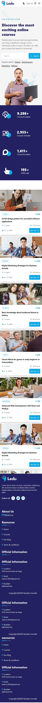

# Project Name

Brief description of your React project.

## Table of Contents

- [Dependencies](#dependencies)
- [Installation](#installation)
- [Usage](#usage)
- [Project Structure](#project-structure)
- [Conditional Rendering](#conditional-rendering)
- [Components](#components)
- [Routes](#routes)
- [ScreenShots](#screenshots)
- [License](#license)

## Dependencies

This project utilizes the following third-party libraries:

```json
 "dependencies": {
    "localforage": "^1.10.0",
    "match-sorter": "^6.3.1",
    "react": "^18.2.0",
    "react-content-loader": "^6.2.1",
    "react-countup": "^6.5.0",
    "react-dom": "^18.2.0",
    "react-icons": "^4.12.0",
    "react-loader-spinner": "^6.1.6",
    "react-router-dom": "^6.21.1",
    "sort-by": "^1.2.0"
  }
```


## Installation 

1. Clone the repository:
```bash
git clone https://github.com/NUR-9922/web-clone-react.git 
cd your-project
```

## Usage
Describe how to run and use your React application. Include any configuration steps if necessary.
```bash
npm install
npm run dev
```

Visit http://localhost:3000 in your browser to view the application.

## Project Structure
Briefly describe the structure of your project, highlighting important directories and files.

```src/
|-- Data/
|   |-- headerCategoriesData/
        |-- headerCategoriesData.js
|   |-- headerUlListData/
        |-- headerUlListData.js
|   |-- courseCardData/
        |-- courseCardData.js
|   |-- footerData/
        |-- footerData.js
    |...
|-- components/
|   |-- Navbar/
|      |-- Navbar.jsx
|   |-- AutoNumberSection/
|      |-- AutoNumberSection.jsx
|   |-- Footer/
|      |-- Footer.jsx
|   |-- ...
|-- pages/
    |-- Home.jsx
|   |-- Login.jsx  
|   |-- Sign-up.jsx
|   |-- ErrorPages.jsx
|   |-- Contact-us.jsx
|   |-- ...
|-- utils/
|-- App.jsx
|-- index.jsx
|-- ...
```

## Conditional Rendering

In this project, conditional rendering is implemented using React's JSX syntax and state management. The components are designed to render different content based on certain conditions. For example, you might have components that render different views based on user authentication status, route parameters, or other dynamic factors.

```
// Example of conditional rendering in React component
function MyComponent({ isAuthenticated }) {
  return (
    <div>
      {isAuthenticated ? <AuthenticatedView /> : <GuestView />}
    </div>
  );
}

```
## Components
### Navbar
The Navbar component is a crucial part of the user interface, providing navigation links and possibly other elements like user authentication status or notifications. It is designed to be reusable across different pages, ensuring a consistent look and feel.

### Footer
The Footer component typically contains information about the project, copyright details, and links to relevant resources. Like the Navbar, the Footer is designed for reuse across various pages to maintain a unified layout.

## Routes

The project defines a set of routes to navigate between different views or pages. The routes are implemented using the react-router-dom library. They help organize the user interface and ensure that the appropriate components are rendered based on the URL.

```
import React from "react";
import ReactDOM from "react-dom/client";
import App from "./App.jsx";
import "./index.css";
import { createBrowserRouter, RouterProvider } from "react-router-dom";
import Home from "./pages/Home";
import Login from "./pages/Login";
import SignUp from "./pages/Sign-up";
import ErrorPage from './pages/ErrorPages.jsx'
import Courses from "./components/Courses/Courses.jsx";
const router = createBrowserRouter([
  {
    path: "/",
    element : <App/>,
    errorElement: <ErrorPage/>,
    children: [
      {
        path: "/",
        element: <Home/>,
      },
      {
        path: "about",
        element: <div>about</div>,
      },
      {
        path: "blog",
        element: <div>blog</div>,
      },
      {
        path : 'courses',
        element : <Courses/>
      },
      {
        path: "cart",
        element: <div>cart</div>,
      }
    ],
   
  },
  {
    path: "contact",
    element: <div>contact</div>,
  },
  {
    path: "login",
    element: <Login/>,
  },
  {
    path: "Signup",
    element: <SignUp/>,
  }
]);

ReactDOM.createRoot(document.getElementById("root")).render(
  <React.StrictMode>
    <RouterProvider router={router} />
  </React.StrictMode>
);

```


In this example, different components are rendered based on the path specified in the URL.

## ScreenShots
### Desktop View 🔽


### Mobile View 🔽


## Contributors

- [NUR-9922](https://github.com/NUR-9922)


## Dark Mode with Local Storage
This React project incorporates a Dark Mode feature, and the user's preference is persisted using the browser's Local Storage. This allows users to maintain their Dark Mode preference across sessions.

## License
This project is licensed under the MIT License, allowing users to freely use, modify, and distribute the code. See the LICENSE file for more details.